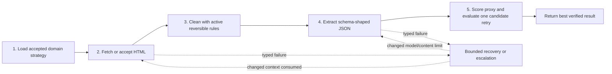

# AI Scraper Prime

[](https://github.com/masood1996-geo/ai-scraper-prime/actions/workflows/ci.yml)
[](https://www.python.org/)
[](LICENSE)

AI Scraper Prime is an audited AI-assisted extraction workflow with rendered-page
fetching, structured LLM output, domain-scoped strategy memory, an explicit
extraction-quality proxy, measured prompt refinement, reversible cleaning rules,
and bounded recovery.

It is a prototype, not a universal or zero-maintenance scraper. Quality scores
measure structural plausibility rather than factual truth, external providers can
fail, and unsupported access-control challenges are escalated instead of bypassed.

## Implementation status

| Capability | Status | Evidence and boundary |
| --- | --- | --- |
| Browser-backed and pre-fetched HTML extraction | Implemented | Both reach `AIScraper.scrape`; browser and LLM boundaries are mock-tested. |
| Typed error classification | Implemented | Typed browser/LLM errors, HTTP status mapping, and an `unknown` fallback. |
| Bounded recovery | Implemented | Real browser/model/context effects plus independently verified retry results. |
| Extraction-quality proxy | Implemented | Six exposed components, deterministic validators, confidence, and uncertainty. |
| Measured prompt refinement | Implemented | Candidate and accepted states are separate; regressions are rejected; rollback is supported. |
| Cleaning-rule learning | Experimental | Repeated evidence is required, rules are reversible, and regressive rules auto-disable. |
| Domain timing memory | Experimental | SQLite-backed and bounded to 1–15 seconds. |
| OpenHouse fallback adapter | Experimental | A tested, opt-in adapter lives in `openhouse-bot-prime`; both projects remain standalone. |
| Command safety | Standalone | Tested library component; the scraper does not execute shell commands. |
| Open WebUI tool | Standalone | Compatibility tool with its own extraction path; it is not the Prime recovery pipeline. |
| CAPTCHA/Cloudflare bypass | Unsupported | Known markers become typed escalation outcomes. |
| Semantic correctness guarantee | Unsupported | The proxy cannot prove source values are true. |
| Production uptime or universal compatibility | Unsupported | Requires deployment and source-specific evidence outside this repository. |

The status-label definitions and full claim-to-code matrix are in
[docs/IMPLEMENTATION_STATUS.md](docs/IMPLEMENTATION_STATUS.md).

## Five-stage execution flow



The runtime modules are:

- `ai_scraper/core.py`: reachable orchestration and retry consumption.
- `ai_scraper/browser.py`: lazy Chrome session, challenge detection, state reset,
  user-agent rotation, and restart.
- `ai_scraper/llm.py`: OpenAI-compatible extraction, code-fence stripping, token
  usage, and typed provider/parse failures.
- `ai_scraper/learner.py`: extraction-quality proxy, deterministic validation,
  candidate generation, timing bounds, and noise-rule proposals.
- `ai_scraper/memory.py`: SQLite evidence, prompt lifecycle, rule lifecycle,
  feedback, and domain history.
- `ai_scraper/recovery.py`: stable failure scenarios, typed step results, attempt
  limits, event ordering, and verified retry success.

## Install

Use a clean virtual environment. AI Scraper Prime is the successor to
`ai-scraper` 1.x and intentionally retains the `ai_scraper` import namespace,
so the two distributions should not be installed in the same environment.

```bash
git clone https://github.com/masood1996-geo/ai-scraper-prime.git
cd ai-scraper-prime
python -m pip install -e .
```

For development:

```bash
python -m pip install -e ".[dev]"
pytest
ruff check .
ruff format --check .
pyright
```

The previous one-command installers were removed because they created an Open
WebUI administrator with a hard-coded password. Create Open WebUI accounts
interactively and install `open_webui_tool.py` manually if that standalone surface
is needed.

## Quick start

Set the credential for the provider you select:

```bash
export OPENROUTER_API_KEY="..."
# PowerShell: $env:OPENROUTER_API_KEY = "..."
```

Then use the CLI:

```bash
ai-scraper-prime scrape https://example.com/listings --schema apartments
ai-scraper-prime schemas
ai-scraper-prime brain
ai-scraper-prime diagnose example.com
```

Or use the Python API:

```python
from ai_scraper import AIScraper, Schema

with AIScraper(
    provider="kilo",
    api_key="...",
    model="kilo-auto/free",
    fallback_model="another-configured-model",
) as scraper:
    listings = scraper.scrape(
        "https://example.com/listings",
        Schema.APARTMENTS,
    )
```

Supported provider presets are OpenRouter, OpenAI, Kilo, and Ollama. A preset is
endpoint configuration, not an availability or pricing guarantee. Other
OpenAI-compatible providers can be added in `ai_scraper/llm.py`.

To avoid a browser in tests or compliant upstream integrations:

```python
results = scraper.scrape(
    "https://example.com/listings",
    Schema.APARTMENTS,
    raw_html=html,
)
```

Known challenge markers are checked in both browser and pre-fetched HTML paths.

## Recovery behavior

Recovery step results are exactly `Applied`, `Unsupported`, `Failed`, or
`Skipped by policy`. Preparing effects does not mean recovery succeeded.
`recovery.succeeded` is emitted only after the subsequent scrape operation returns
without an exception.

| Failure | Default effects | Retry consumes | Status |
| --- | --- | --- | --- |
| Network timeout | Exponential backoff | New browser fetch | Implemented |
| Rate limit | Cooldown | New operation | Implemented |
| Empty page | Increase wait, clear state, restart | New browser wait/session | Implemented |
| Browser crash | Restart | New browser session | Implemented |
| JSON parse failure | Reduce content | `LLMClient.extract(max_chars=...)` | Implemented |
| LLM extraction failure | Reduce content | Next LLM input | Implemented |
| LLM provider failure | Backoff, configured fallback model | Real next model request | Partial when no fallback is configured |
| CAPTCHA/Cloudflare | Pause/skip and escalate | No automatic bypass retry | Unsupported |
| Unknown failure | Escalate | No guessed recovery | Unsupported |

User-agent rotation is a real registered handler but is not part of the default
challenge recipes. This avoids presenting identity rotation as access-control
circumvention.

## What “learning” means

Learning means local, bounded strategy memory. It does not mean model training.

- Domain timing uses a bounded update based on observed proxy quality.
- A prompt refinement is stored first as a candidate, evaluated on one retry, and
  accepted only if it improves the proxy by the configured minimum.
- Accepted prompts are versioned, domain-and-schema scoped, usage-counted, and
  reversible.
- Cleaning rules start as candidates. Automatic activation requires repeated
  evidence and at least 0.70 combined confidence.
- Active rules track outcomes and disable themselves after repeated regressions.
- The database stores strategy evidence and metrics, not page HTML, screenshots,
  cookies, or API keys.

The default database is `~/.ai_scraper/memory.db`. Set `learning=False` for a
stateless integration.

## Extraction-quality proxy

The score combines:

- field fill rate;
- basic non-placeholder validity;
- uniqueness;
- garbage-content detection;
- deterministic schema checks such as URLs, emails, dates, numeric ranges, and
  non-negative values;
- a bounded result-count signal.

Every assessment exposes component scores, confidence, uncertainty, validation
errors, and `semantic_correctness_guaranteed: false`. A score of `1.0` means the
observed output satisfied the configured heuristics; it does not mean the values
match reality. Optional LLM review would be nondeterministic and is not enabled by
this pipeline.

Custom schemas may declare deterministic constraints:

```python
schema = {
    "url": {"type": "url", "required": True},
    "rating": {"type": "number", "min": 0, "max": 5},
}
```

## Command safety placement

`ai_scraper.command_safety` is a tested standalone validator for future
action-taking agents. AI Scraper has no command-execution surface, so the scraper
does not claim this component protects browsing or LLM requests. Integrators must
route every command through it themselves; importing the class alone provides no
protection.

## OpenHouse relationship

[OpenHouse Bot Prime](https://github.com/masood1996-geo/openhouse-bot-prime)
declares AI Scraper Prime as an optional package extra and contains the tested
`AIScraperPrimeCrawler` adapter. When explicitly enabled, the adapter calls
`AIScraper.scrape(...)`, normalizes its output, and returns records to OpenHouse's
normal filtering, deduplication, and notification pipeline.

AI Scraper is not the engine underneath OpenHouse's native crawlers, and neither
repository requires the other for standalone use.

## Security and privacy

- API keys are constructor inputs or environment variables and are not stored in
  SQLite.
- Logged URLs remove credentials, query strings, and fragments.
- Diagnostics preserve error type/module/status without exception messages.
- Page HTML, screenshots, cookies, and browser-session data are not persisted by
  the Prime pipeline.
- Challenge handling does not implement CAPTCHA or Cloudflare circumvention.
- Operators remain responsible for site terms, robots directives, rate limits,
  applicable law, and provider contracts.

See [docs/SECURITY.md](docs/SECURITY.md) for operational guidance.

## Tests and CI

The suite uses fake browsers, fake LLM providers, local HTML, and temporary SQLite
databases. CI does not call paid providers or live websites. It covers Python
3.10–3.13, unit and mocked integration tests, 75% minimum package coverage, Ruff,
formatting, Pyright, package build, CLI smoke, and dependency audit.

## License and attribution

AI Scraper Prime is licensed under the [MIT License](LICENSE). Recovery and command
safety patterns were adapted from the separately referenced `claw-code-parity`
design and rewritten for this Python runtime. See
[docs/ATTRIBUTION.md](docs/ATTRIBUTION.md).
